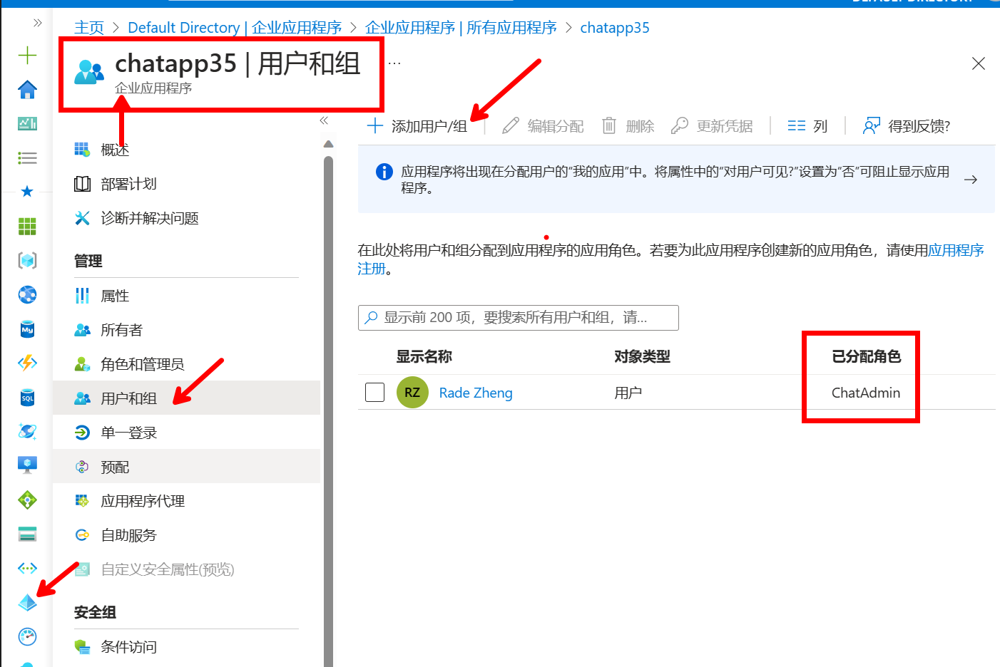
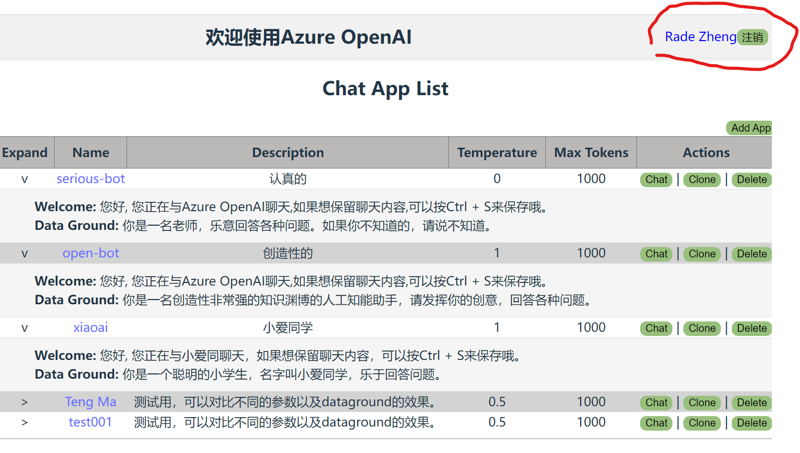
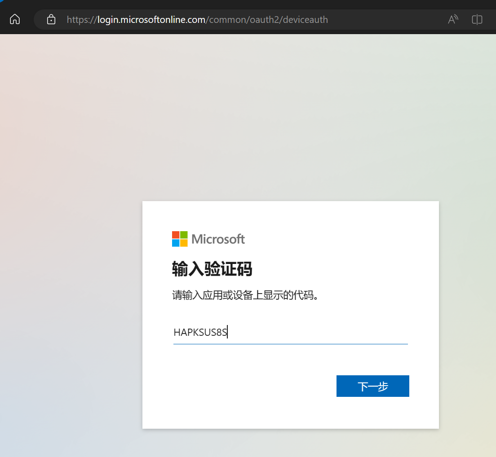

# 这是一个支持AAD认证的Azure OpenAI 的客户端
当您拿到Azure OpenAI的订阅时，创建完服务，可以使用这个项目来部署第一个应用，分享给同事或朋友一起探索。<br/>


- 前端是用Vue 3 + TypeScript + Vite来实现. 移动设备显示可自适应。<br/>
- 后端使用express JS API来调用Azure API 管理平台，再到Azure OpenAI的endpoint. AOAI的key不会提供给前端<br/>
- 聊天记录不会在后端保存，但可以使用APIM的日志管理和审计特性来管理。
- 支持 GPT-3.5和 GPT-4 的流式API显示
- 支持定义多种参数的多个聊天app, 不同的app不同的url, 可以分发给不同的人。也方便对比不同参数的效果。
- 这个repo整合 AAD 认证和登录，不需要的参考 [tsgpt](https://github.com/radezheng/tsgpt)
- 可以通过APIM的Policy实现多AOAI 后端的负载均衡，提高rate limit. 部署完后，参考后面负载均衡的部份。

部署的架构参考:


首页需要AAD 登录:<br/>

<br/>只有有chat.admin角色权限的用户才能对chat app修改，默认租户管理员已配好权限。一般用户只能使用定义好的chat app的url进行聊天，需要在AAD的管理界面添加权限。


App列表：


添加App时指定参数：


聊天界面：


## 部署步骤
### 创建Azure资源
- 下载安装PowerShell 7 (脚本需要verion 7+), [点这里下载 Win64版](https://github.com/PowerShell/PowerShell/releases/download/v7.3.4/PowerShell-7.3.4-win-x64.msi)。其他参考 [PowerShell 7 安装指南](https://docs.microsoft.com/zh-cn/powershell/scripting/install/installing-powershell?view=powershell-7.1)

- 下载安装sqlcmd, 用于初始化数据库。***安装完请重新打开PowerShell命令窗口*** [下载安装参考](https://learn.microsoft.com/zh-cn/sql/tools/sqlcmd/sqlcmd-utility?view=sql-server-ver16)

- 获取Azure OpenAI的部署，模型ID和Key

- 准备docker的运行环境。如果没有docker环境，可以参考[这里](https://docs.docker.com/get-docker/)安装docker。如果已经有docker环境，可以跳过这步。

- 打开文件[./script/createAll.ps1](./script/createAll.ps1), 按提示修改如下变量:

```bash
$RESOURCE_GROUP_NAME="rgOpenAIChat"
$LOCATION="eastasia"

#for AAD
$Tenant_Id = "<your tenant id>"

#for DB
#需全球唯一
$SQL_SERVER_NAME="<your unique sql server name>"
$ADMIN_USERNAME="<your admin username>"
$ADMIN_PASSWORD=Read-Host "Enter the admin password"
$DB_NAME="dbGPT"

#for APIM
#需全球唯一
$SVC_NAME="<your unique apim name>"
$API_ID="azuregpt-api"
$AOAI_DEPLOYMENT_ID="<your deployment id>"
$AOAI_MODEL_ID="<your model id>"
$AOAI_KEY=$AOAI_KEY = Read-Host "Enter the Azure OpenAI key"
#服务创建完成会发邮件通知
$APIM_PUBLISHER_EMAIL="<your email>"
$PUBLISHER="<your publisher name>"

#for webapp
$VUE_APP_APIM_HOST=$SVC_NAME + ".azure-api.net"
#等待API服务创建完成手动在Portal填写
$VUE_APP_APIM_KEY="xxx"
#需全球唯一, 可改为自己容易记的名字。bot访问的地址为 https://<your app name>.azurewebsites.net
$APP_NAME="chat$(Get-Date -Format 'MMddHHmmss')"
#需全球唯一
$ACR_NAME="<your acr name>"
#改为自己的镜像地址, 会包含你定义的AAD tenant信息
$DOCKER_IMAGE="$ACR_NAME.azurecr.io/<change to your own image, e.g. tsgptAAD:basic>"

```
- Tenant ID 可以在Azure Portal里找到，也可以用下面的命令查看
```powershell
Connect-AzAccount
Get-AzTenant
#复制返回的Id 字段
```
或者在Portal里查找:


### 开始部署
- 打开powershell, , 按下面代码运行脚本进行自动化部署
```powershell
#确认版本 Major 是 7
$PSVersionTable.PSVersion

#需要在script目录下运行
cd script
.\createAll.ps1
```
- 按提示输入密码(DB)和Azure OpenAI的key
- 需要用AAD租户管理员登录一下指定的租户。<br/>



<br/>然后等运行完。
- 脚本跑完之后会打出web app URL:

<br/>
之后的报错是正常的，因为APIM还在后台的Job中创建，会隔30秒检查一下其状态。等APIM创建完成后，再继续下面的步骤。
- 可以用powershell 查看后台Job的输出:
```powershell
Get-Job | Sort-Object -Property PSBeginTime -Descending | Select-Object -First 1 | Receive-Job
```

## 配置Azure资源
 - APIM策略，打开.\apim\policy.xml, 复制全部内容，粘贴到 azure portal里的apim policy。如果想用多个aoai 后端，忽略这步。参考后面多个后端的配置。
 
 

 - 获取apim的key, 更新到web app的环境变量.
 打开APIM的订阅，显示Unlimited订阅的key:
 
 复制key:
 
 打开Web App, 在配置里更新 VUE_APP_APIM_KEY , 点击保存。
 
 重启一个Web App

 - 部署完成
 正常的话应该可以访问部署后的webapp, 第一次打开会有点慢。
 https://<app_name>.azurewebsites.net
 

## [可选] 部署多个Azure OpenAI的Endpoint/key
- 创建和部署多个Azure OpenAI的GPT3.5或GPT4模型，并拿到相关demployment id, model id和key
- 在Azure APIM 创建多个backend:
URL格式必须是一样，不能多不能少。并设定api-key的header. 可以为手动指定，或命名值。
```bash
# 替换为相应backend的值 
https://<depoyment_id>.openai.azure.com/openai/deployments/<model_id>  
```

- 打开API *** Post *** 接口的Policy:

- 将 内容全部复制替换 为 ./apim/loadbanlance.xml

如果有多个backend, 修改 "2" 为相应的数量，并按条件增加路由项。
## [可选] API的监控与审计


## 如果本地开发调试
- 按前面部署好Azure服务准备
- 复制 env.example到 .env, 并设定相关变量值
- 然后运行下面脚本，还是需要配置AAD和APIM.
```powershell

#配置AAD
cd .\script
.\ConfigureAAD.ps1 -TenantId <your tenant id>

#配置APIM
#call create apim, may need 20 to 30 minutes
Set-Location -Path $PWD
$job = Start-Job -FilePath "createAPIM.ps1" -ArgumentList $RESOURCE_GROUP_NAME, $LOCATION, $SVC_NAME, $API_ID, $AOAI_DEPLOYMENT_ID, $AOAI_MODEL_ID, $AOAI_KEY, $APIM_PUBLISHER_EMAIL, $PUBLISHER, $PWD

#等待APIM创建完成，需要20到30分钟

cd ..

npm install


#启动 express API server
npm run start:server

#另一窗口，启动前端
npm run dev
```
按提示访问前端即可

--- 


